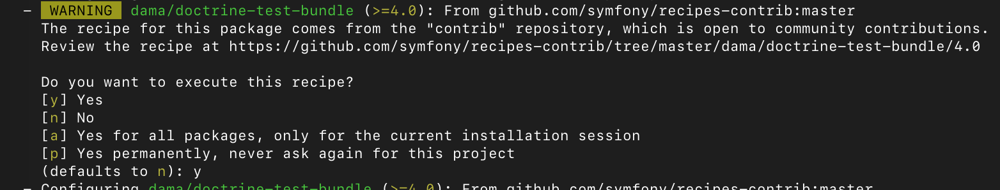
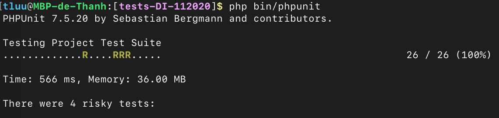
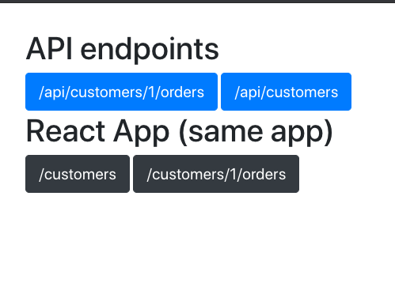
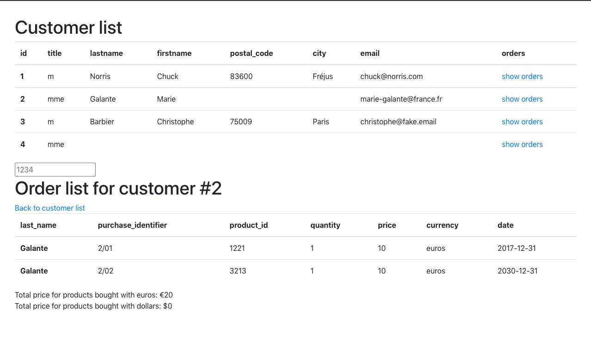

# tests-DI-112020

## Setup

### Backend and frontend
Install composer dependencies `composer install` <br/>
You might be prompted to install `dama/doctrine-test-bundle`: say yes, we need this for phpunit



Install frontend dependencies `npm install`

### Database

A file named `setup.sh` is present in the root folder. You can execute it after giving it privilege:

```
chmod +x setup.sh
./setup.sh
```

### PhpUnit

If PhpUnit was correctly installed, execute: `php bin/phpunit` <br/>

Otherwise you need to reinstall it:
```
composer remove symfony/phpunit-bridge
composer require --dev symfony/phpunit-bridge
```
And replace some files that were overwritten
(see https://symfony.com/doc/4.4/testing/database.html#resetting-the-database-automatically-before-each-test
for more info) <br/>
```
cp phpunit.xml.dist.bck phpunit.xml.dist
cp .env.test.bck .env.test
```

Now you can execute the tests 
```
php bin/phpunit
```


### Launching the project
First compile the React components `npm run dev` <br/>
Now a localhost server `symfony server:start`<br/>



## Results

### Backend

#### Command
New command `ugo:orders:import`. <br/>
Usage: `ugo:orders:import <pathToCustomerCsv> <pathToOrdersCsv>`
* Paths can be relative or absolute (checked in this order)
* First line is skipped because assumed to be header lines
* For 'Customer', headers are: `id, title, lastname, firstname, postal_code, city, email`
* For 'Orders', headers are: `id, customer_id, product_id, quantity, price, currency, date`
* Delimiter is `;`

#### API endpoints
Two new API endpoints for `Customer` entity:
* `/api/customers`: list all existing customers in database
* `/api/customers/{customer_id}/orders`: list all orders for the related customers if it exists, `404` otherwise

### Frontend
Let's be honest: the frontend is a failure... 😭 <br/>
Here are the reason why I failed this part of the test:
* **Issue with integration**: it is the first time I set up a Symfony from scratch all by myself. <br/>
I was not able to correctly integrate TypeScript (thus I could not use it...) <br/>
Same problem for the frontend test framework

* **TypeScript** was not integrated so I had to rely on ES6 only, sorry!

* **React**: I did not understand how to correctly route my ReactJs components to my Symfony routing. 
I did try using 'ReactRouter' but the doc was not maintained so I give up after some hours of testing...

<hr/>

Even though I did not use TypeScript, I still tried to make components from what was asked. <br/>
You should see a one page app (instead of 2 different pages):



I added an input so that you can dynamically query a customer's order list based on their id.